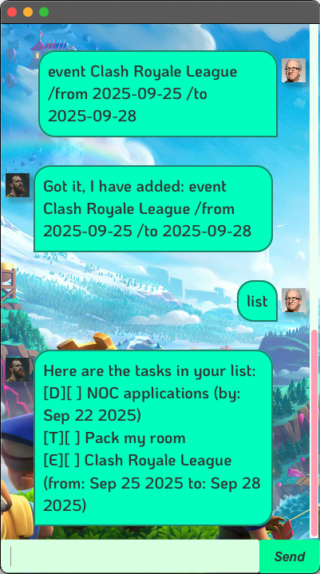

# NixChats User Guide

NixChats is a **desktop application for managing your tasks, optimized for use via a Command Line Interface** (CLI) while still having the benefits of a Graphical User Interface (GUI). If you can type fast, NixChats can get your task management done faster than traditional GUI applications.



## Quick Start

1. Ensure you have Java `17` or above installed in your Computer.
2. Download the latest `nixchats.jar` from [here](https://github.com/nicksonho/ip/releases).
3. Copy the file to the folder you want to use as the _home folder_ for your NixChats.
4. Open a command terminal, `cd` into the folder you put the jar file in, and use the `java -jar nixchats.jar` command to run the application. A GUI similar to the below should appear in a few seconds.
5. Type the command in the command box and press Enter to execute it. e.g. typing **`list`** and pressing Enter will show all your tasks.
6. Refer to the [Features](#features) below for details of each command.

----

## Features

> **Notes about the command format:**<br>
> * Words in `UPPER_CASE` are the parameters to be supplied by the user.<br>
>   e.g. in `todo DESCRIPTION`, `DESCRIPTION` is a parameter which can be used as `todo buy groceries`.
> * Items in square brackets are optional.<br>
>   e.g `find KEYWORD` can be used as `find book` or `find assignment`.
> * Dates should be entered in `YYYY-MM-DD` format (e.g., `2025-12-31`).<br>
>   When displayed, dates will be formatted as `MMM dd yyyy` (e.g., `Dec 31 2025`).

### Adding a todo task: `todo`

Adds a todo task to your task list.

**Format:** `todo DESCRIPTION`

**Example:** `todo buy groceries`

**Expected output:**
```
Got it, I have added: todo buy groceries
```

### Adding a deadline task: `deadline`

Adds a task with a deadline to your task list.

**Format:** `deadline DESCRIPTION /by DATE`

**Example:** `deadline submit assignment /by 2025-01-31`

**Expected output:**
```
Got it, I have added: deadline submit assignment /by 2025-01-31
```

### Adding an event task: `event`

Adds an event task with start and end dates to your task list.

**Format:** `event DESCRIPTION /from START_DATE /to END_DATE`

**Example:** `event team meeting /from 2025-01-15 /to 2025-01-16`

**Expected output:**
```
Got it, I have added: event team meeting /from 2025-01-15 /to 2025-01-16
```

**Expected output:**
```
Got it, I have added: event team meeting /from 2025-01-15 /to 2025-01-16
```

### Listing all tasks: `list`

Shows a list of all tasks in your task list.

**Format:** `list`

**Expected output:**
```
Here are the tasks in your list:
[T][ ] buy groceries
[D][ ] submit assignment (by: Jan 31 2025)
[E][ ] team meeting (from: Jan 15 2025 to: Jan 16 2025)
```

### Marking a task as done: `mark`

Marks the specified task as completed.

**Format:** `mark INDEX`

* Marks the task at the specified `INDEX` as done.
* The index refers to the index number shown in the displayed task list.
* The index **must be a positive integer** 1, 2, 3, …​

**Example:** `mark 2`

**Expected output:**
```
Nice! I've marked this task as done:
  [D][X] submit assignment (by: Jan 31 2025)
```

### Unmarking a task: `unmark`

Marks the specified task as not completed yet.

**Format:** `unmark INDEX`

* Marks the task at the specified `INDEX` as not done.
* The index refers to the index number shown in the displayed task list.
* The index **must be a positive integer** 1, 2, 3, …​

**Example:** `unmark 2`

**Expected output:**
```
OK, I've marked this task as not done yet:
  [D][ ] submit assignment (by: Jan 31 2025)
```

### Deleting a task: `delete`

Deletes the specified task from your task list.

**Format:** `delete INDEX`

* Deletes the task at the specified `INDEX`.
* The index refers to the index number shown in the displayed task list.
* The index **must be a positive integer** 1, 2, 3, …​

**Example:** `delete 3`

**Expected output:**
```
Got it, deleted task [E][ ] team meeting (from: Jan 15 2025 to: Jan 16 2025)
```

### Finding tasks: `find`

Finds tasks whose descriptions contain the given keyword.

**Format:** `find KEYWORD`

* The search is case-insensitive. e.g `meeting` will match `Meeting`
* Tasks matching the keyword will be displayed.

**Example:** `find assignment`

**Expected output:**
```
Here are the matching tasks in your list:
1.[D][ ] submit assignment (by: Jan 31 2025)
```

### Undoing previous action: `undo`

Undoes the most recent action that modified your task list.

**Format:** `undo`

* Only commands that modify the task list can be undone: `todo`, `deadline`, `event`, `mark`, `unmark`, `delete`
* Commands like `list`, `find`, and `bye` cannot be undone.
* You can undo multiple actions in sequence.

**Example:** `undo`

**Expected output:**
```
Undone: add task: buy groceries
```

### Exiting the program: `bye`

Exits the program.

**Format:** `bye`

**Expected output:**
```
Bye! Hope to see you again soon!
```

### Saving the data

NixChats data are saved in the hard disk automatically after any command that changes the data. There is no need to save manually.

### Editing the data file

NixChats data are saved automatically as a text file `[JAR file location]/data/NixChatHistory.txt`. Advanced users are welcome to update data directly by editing that data file.

> ⚠️ **Caution:**
> If your changes to the data file makes its format invalid, NixChats will discard all data and start with an empty data file at the next run. Hence, it is recommended to take a backup of the file before editing it.

----

## FAQ

**Q**: How do I transfer my data to another Computer?<br>
**A**: Install the app in the other computer and overwrite the empty data file it creates with the file that contains the data of your previous NixChats home folder.

**Q**: Can I use different date formats?<br>
**A**: No, NixChats only accepts dates in `YYYY-MM-DD` format (e.g., `2025-12-31`) for input, but displays them in the more readable `MMM dd yyyy` format (e.g., `Dec 31 2025`).

**Q**: What happens if I accidentally delete a task?<br>
**A**: You can use the `undo` command to restore the most recently deleted task.

----

## Command Summary

| Action | Format, Examples |
|--------|------------------|
| **Add Todo** | `todo DESCRIPTION` <br> e.g., `todo buy groceries` |
| **Add Deadline** | `deadline DESCRIPTION /by DATE` <br> e.g., `deadline submit assignment /by 2025-01-31` |
| **Add Event** | `event DESCRIPTION /from START_DATE /to END_DATE` <br> e.g., `event team meeting /from 2025-01-15 /to 2025-01-16` |
| **List** | `list` |
| **Mark** | `mark INDEX` <br> e.g., `mark 3` |
| **Unmark** | `unmark INDEX` <br> e.g., `unmark 1` |
| **Delete** | `delete INDEX` <br> e.g., `delete 2` |
| **Find** | `find KEYWORD` <br> e.g., `find assignment` |
| **Undo** | `undo` |
| **Exit** | `bye` |